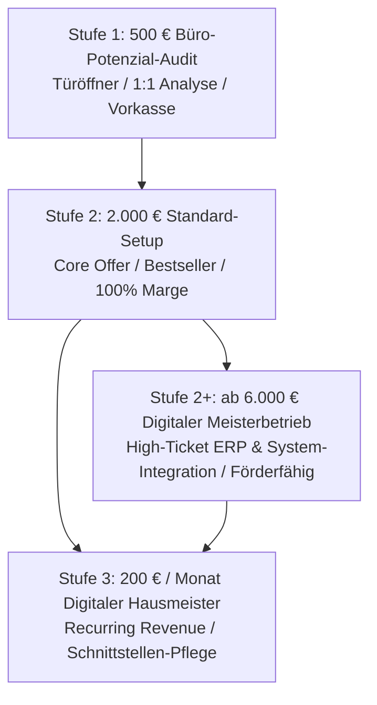

# 📑 Businessplan: KMU Service Harz UG (haftungsbeschränkt)
**Unternehmenskonzept für No-Code-Prozessautomatisierung, digitale Belegerfassung und Schnittstellen-Infrastruktur für den Mittelstand und das Handwerk in der Region Harz.**

*Gründer & Geschäftsführer:* Robin Gornitzka  
*Standort:* 38685 Langelsheim / Wirtschaftsregion Harz (Landkreise Goslar & Harz)  
*Stand:* 2026

---

## 1. Executive Summary

### 1.1 Wer wir sind und was wir machen
**„KMU Service Harz“** ist der pragmatische Schnittstellenbauer und Prozess-Befreier für den regionalen Mittelstand und das Handwerk. Wir befreien kleine und mittlere Unternehmen (1 bis 50 Beschäftigte) von zeitraubender Zettelwirtschaft, Beleg-Sucherei und unbezahlten Büro-Sonntagen. 

Durch den gezielten Einsatz moderner Low-Code/No-Code-Automationen (z. B. Make, n8n), optischer Zeichenerkennung (OCR) und Standard-Schnittstellen (DATEV, Lexware Office, Google Workspace, WhatsApp Business) verbinden wir bestehende Insellösungen im Hintergrund. 

**Unser Kundenversprechen:** Keine Schulung für neue Software, 100 % GoBD- und E-Rechnungskonformität (ZUGFeRD / XRechnung) und messbare Zeitersparnis von ca. 16 Stunden pro Monat – garantiert zum transparenten Festpreis.

---

### 1.2 Das Problem im Markt
Der Mittelstand in der Wirtschaftsregion Harz steht unter doppeltem Druck:
1. **Extremer Fach- und Arbeitskräftemangel:** Personalengpässe zwingen Betriebe, administrative Routineaufgaben zu minimieren.
2. **Erdrückende Bürokratielast & Regulierungsdruck:** Handwerksmeister verbringen durchschnittlich 32 unproduktive Stunden im Monat mit Papierkram. Gesetzliche Pflichten wie die B2B-E-Rechnungspflicht erzeugen akuten Handlungsdruck.

**Das Marktparadoxon:** 76 % der KMU spüren Wettbewerbsnachteile durch fehlende Digitalisierung, meiden jedoch klassische IT-Projekte aus Angst vor unkalkulierbaren Stundensätzen, teuren Systemhäusern und unverständlichem IT-Jargon.

---

### 1.3 Unsere Zielgruppe
Wir fokussieren uns grenzscharf auf regionale Kleinunternehmen mit 1 bis 50 Mitarbeitenden ohne eigene IT-Abteilung:
* **Fokus 1: Lokales Handwerk & Baugewerbe (SHK, Elektro, Dach, Bau, GaLaBau):** Starker Backoffice-Schmerz, knitterige Belege im Firmenwagen, manuelle Stundenzettel, Bedarf an automatisierter DATEV-Kanzleiübergabe.
* **Fokus 2: Dienstleister & Praxen (Gebäudereinigung, Pflegedienste, Hausverwaltungen):** Hohes Dokumenten- und Belegaufkommen, Terminkoordination.

---

### 1.4 Warum wir besser sind (Unser USP & Geschäftsmodell)
Wir positionieren uns als verständlicher **„Handwerker für digitale Infrastruktur“** und heben uns durch drei Hebel vom Markt ab:

1. **Schlüsselfertige Festpreise („Productized Services“):** Wir verkaufen keine offenen Beratungsstunden, sondern standardisierte Festpreispakete (z. B. *„Das Standard-Setup“* für 2.000 € Festpreis) mit kalkulierbarem Return on Investment (Amortisation in unter 8 Wochen).
2. **Schneller ROI statt Förder-Wartezeit & gezielter Förderhebel:** Unser Kernangebot (2.000 € Setup) funktioniert komplett ohne behördliche Wartefristen und wird rein über den betriebswirtschaftlichen Nutzen verkauft. Für größere Transformationsprojekte (ab 6.000 € Investition für ERP- und Systemintegrationen) binden wir staatliche Förderprogramme (*Digital Innovation Sachsen-Anhalt* bis 50 % Zuschuss, *INQA-Coaching* bis 80 % Zuschuss) als Vertriebshebel ein.
3. **Planbare wiederkehrende Umsätze (MRR):** Nach der Implementierung sichert unser Retainer *„Digitaler Hausmeister“* (200 € / Monat) die dauerhafte Stabilität aller Schnittstellen und generiert planbare, monatlich wiederkehrende Einnahmen.

---

## 2. Geschäftsidee und Leistungsangebot

### 2.1 Das Problem und der Pain Point
Kleine Handwerksbetriebe verbringen ihre Wochenenden mit der manuellen Vorkontierung knitteriger Quittungen, dem mühsamen Abtippen von Stundenzetteln und der Vorbereitung des Monatsabschlusses für den Steuerberater. Das führt zu Reibungsverlusten, Frust in den Familien und teuren Rückfragen der Steuerkanzlei.

### 2.2 Die Lösung: Die 4-stufige Value Ladder (Produktmatrix)

#### Stufe 1: Büro-Potenzial-Audit (500,00 € netto Festpreis)
* **Ziel:** Risikominimierter Einstieg zum Aufbau von Kundenvertrauen.
* **Inhalt:** 90-minütige 1:1-Ist-Analyse der administrativen Prozesse vor Ort oder per Video. Erstellung eines schriftlichen ROI-Fahrplans mit Identifikation der 3 größten Zeitfresser.
* **Geschäftsfunktion:** Vorkasse-Modell zur sofortigen Liquiditätsgenerierung; wandelt 60–70 % der Leads in das Hauptsetup um.

#### Stufe 2: Das Standard-Setup: Lautlose Belegerfassung (2.000,00 € netto Festpreis – Bestseller)
* **Ziel:** Schlüsselfertige Beseitigung der Zettelwirtschaft in 1–2 Wochen.
* **Inhalt:** 
  - Einrichtung des mobilen Belegeingangs (Mitarbeiter fotografiert Beleg via WhatsApp/Mail).
  - Automatische Texterkennung (OCR) und GoBD-konforme Vorkontierung in Lexware Office.
  - Revisionssichere DATEV-Schnittstellenanbindung an die Steuerberaterkanzlei.
  - 14 Tage intensive Einführungsbegleitung für das Mitarbeiter-Team.
* **Marge & Wirtschaftlichkeit:** Nahezu 100 % Dienstleistungsmarge (0 € Materialaufwand). Amortisiert sich für den Handwerker in knapp 8 Wochen (bei 16 Std. Zeitersparnis/Monat à 55 €/Std. = 880 € monatlicher Gegenwert).

#### Stufe 2+ (Optionales High-Ticket-Upgrade): Digitaler Meisterbetrieb (ab 6.000,00 € netto)
* **Ziel:** Umfassende Prozess- und Softwaretransformation für wachsende Betriebe.
* **Inhalt:** Tiefgreifende Integration von Handwerker-ERP-Systemen (z. B. pds, KWP, WinWorker) an Buchhaltung und Kanzlei, individuelle Make/n8n-Automationspipelines, Multi-User-Rechtestrukturen, Mitarbeiterschulung.
* **Fördermittel-Hebel:** Erreicht die Bagatellgrenzen staatlicher Programme (z. B. *Digital Innovation Sachsen-Anhalt* mit 50 % Zuschuss oder *INQA-Coaching* mit 80 % Zuschuss für Prozessberatung).

#### Stufe 3: Digitaler Hausmeister (200,00 € netto / Monat – AaaS Retainer)
* **Ziel:** Dauerhafter Betrieb & Absicherung der Schnittstellen.
* **Inhalt:** 24/7-Monitoring aller aktiven API-Verbindungen, Fehlerbehebung bei Drittanbieter-Updates (DATEV, Lexoffice, Google), inkl. 1 Stunde monatliches Kontingent für Anpassungen.
* **Geschäftsfunktion:** Aufbau von Monthly Recurring Revenue (MRR) mit Customer Lifetime Value > 4.800 € bei 24 Monaten durchschnittlicher Haltedauer.

---

## 3. Markt- und Wettbewerbsanalyse

### 3.1 Regionale Marktlage im Harz
In den Landkreisen Goslar und Harz existieren über 4.500 eingetragene Handwerks- und Dienstleistungsbetriebe. Der Digitalisierungsgrad im Backoffice ist traditionell gering. Durch das Auslaufen des niedersächsischen Digitalbonus hat sich der Markt bereinigt: Agenturen, die reine Fördermittel-Subventionsritter waren, verlieren ihre Grundlage. KMU Service Harz gewinnt Kunden über **echte Wirtschaftlichkeit (ROI)**.

### 3.2 Wettbewerbsabgrenzung

| Anbieter-Typ | Typische Schwäche | Der Vorteil von KMU Service Harz |
| :--- | :--- | :--- |
| **Klassische IT-Systemhäuser** | Fokussieren Server, Firewalls & Hardware; lösen keine Beleg- & Büroprozesse; hoher Techniker-Stundensatz. | Wir optimieren administrative Prozesse und Schnittstellen zum garantierten Festpreis. |
| **Werbe- & Webagenturen** | Stark in Marketing/Webdesign; keine DATEV-/Lexoffice- oder Buchhaltungskompetenz. | Wir beherrschen GoBD, E-Rechnung und Kanzlei-Standards. |
| **Überregionale No-Code-Agenturen** | Rein remote, Corporate-Jargon, teure Stundensätze, keine regionale Nähe. | Persönlich vor Ort im Harz, bodenständige Sprache auf Augenhöhe. |

---

## 4. Zielgruppen und Vertriebsstrategie

### 4.1 Die „Huckepack-Strategie“ mit Multiplikatoren (Primärer Kanal)
Statt teurer Kaltakquise bauen wir strategische Allianzen mit **Steuerberatern und Wirtschaftsprüfern** im Harz auf. Steuerberater leiden massiv unter fehlerhaften, unvollständigen Belegen ihrer Mandanten. Sie empfehlen KMU Service Harz aktiv als Umsetzungspartner, weil sie dadurch fertige, vorkontierte DATEV-Datensätze erhalten.

### 4.2 Regionale Direktansprache & Innungen
* **Impulsvorträge & Workshops:** Kooperationen mit Wirtschaftsförderungen (z. B. WiReGo), Handwerkskammern und Kreishandwerkerschaften zum Thema *„B2B-E-Rechnung & Beleg-Chaos meistern“*.
* **Gezielte Ansprache:** Postalische Mailings an Handwerksmeister mit persönlichem Follow-up via Telefon/WhatsApp.

---

## 5. Risikomanagement & Rechtssicherheit

1. **Rechtsdienstleistungsgesetz (§ 5 RDG):** Die Unterstützung bei Förderunterlagen erfolgt strikt als erlaubte Nebenleistung im Zusammenhang mit der technischen Implementierung. Es wird keine isolierte Rechts- oder Steuerberatung erbracht.
2. **Wettbewerbsrecht (§ 5 UWG):** Es werden keine unrealistischen Fördergarantien ausgesprochen. Angebote basieren auf transparenten Festpreisen und messbarem ROI.
3. **Verbot des vorzeitigen Maßnahmenbeginns:** Bei geförderten Projekten (ab 6.000 €) wird strikt darauf geachtet, dass Verträge erst nach offizieller Antragstellung geschlossen werden.

---

## 6. Finanzplan, Liquiditäts- und Rentabilitätsrechnung

### 6.1 Kapitalbedarf & Finanzierung (CapEx)
Die Gründung erfolgt als schuldenfreies Bootstrapping-Startup. Der gesamte Kapitalbedarf beträgt **1.850,00 €** und wird zu 100 % über den Sachmittelzuschuss nach § 16c SGB II finanziert:
* Hardware-Infrastruktur (verschlüsselter Business-Laptop & Peripherie): 1.100,00 €
* Gründungs- und Notarkosten (UG i.G., Handelsregister, Gewerbe): 400,00 €
* IT-Setup & Lizenzen (Make.com, Hosting, Domains, eRecht24): 350,00 €

Der Lebensunterhalt in der Anlaufphase (Monate 1–6) wird über Einstiegsgeld nach § 16b SGB II abgesichert.

---

### 6.2 Laufende Betriebsausgaben (OpEx)
Dank Home-Office-Infrastruktur belaufen sich die monatlichen Fixkosten in Jahr 1 auf lediglich **350,00 €** (4.200,00 € p.a.):
* Software-Abonnements & APIs: 80,00 €
* IT-Haftpflicht & Rechtssicherheit: 75,00 €
* Externe Buchhaltung / Steuerberater: 100,00 €
* Geschäftskonto, Hosting & IHK: 55,00 €
* Puffer für Sonstiges: 40,00 €

---

### 6.3 Erlös- und Rentabilitätsplanung (Jahre 1 bis 3)

| Position | Jahr 1 | Jahr 2 | Jahr 3 |
| :--- | :--- | :--- | :--- |
| **Umsatzerlöse (Netto)** | **41.400,00 €** | **90.200,00 €** | **150.000,00 €** |
| - *Stufe 1 (Audits)* | 18x 500 € = 9.000 € | 30x 500 € = 15.000 € | 40x 500 € = 20.000 € |
| - *Stufe 2 (Standard-Setups)* | 12x 2.000 € = 24.000 € | 22x 2.000 € = 44.000 € | 32x 2.000 € = 64.000 € |
| - *Stufe 3 (AaaS-Retainer)* | 10 Kunden (8.400 € kum.) | 25 Kunden (31.200 € kum.) | 45 Kunden (66.000 € kum.) |
| **Variable Kosten (10 %)** | - 4.140,00 € | - 9.020,00 € | - 15.000,00 € |
| **Rohertrag (Deckungsbeitrag)** | **37.260,00 €** | **81.180,00 €** | **135.000,00 €** |
| **Fixkosten (OpEx)** | - 4.200,00 € | - 6.000,00 € | - 8.880,00 € |
| **EBITDA** | **33.060,00 €** | **75.180,00 €** | **126.120,00 €** |
| Geschäftsführervergütung (ab M7) | - 13.800,00 € | - 27.600,00 € | - 36.000,00 € |
| **Ergebnis vor Steuern (EBT)** | **19.260,00 €** | **47.580,00 €** | **90.120,00 €** |
| Steuerrückstellung (~30 %) | - 5.778,00 € | - 14.274,00 € | - 27.036,00 € |
| **Jahresüberschuss (Netto)** | **13.482,00 €** | **33.306,00 €** | **63.084,00 €** |

---

### 6.4 Break-Even-Analyse
* **Monatliche Fixkosten:** 350,00 €
* **Deckungsbeitrag pro Audit (500 € - 10 %):** 450,00 €
* **Break-Even-Punkt:** **0,77 Aufträge pro Monat** (bereits mit 1 einzigen Audit pro Monat arbeitet das Unternehmen profitabel).

---

### 6.5 Tragfähigkeitsbegründung für Behörden & Prüfstellen
Das vorliegende Konzept weist eine herausragende Tragfähigkeit auf:
1. **0,00 € Verschuldung:** Vollständiger Verzicht auf Bankkredite durch § 16c Sachmittelzuschuss.
2. **Keine Förderabhängigkeit im Kerngeschäft:** Das 2.000 € Standard-Setup amortisiert sich in 8 Wochen aus eigener Kraft.
3. **Planbarkeit durch MRR:** Ab Monat 7 sichern die AaaS-Retainer den laufenden Cashflow für ein vollwertiges Geschäftsführergehalt und beenden die Hilfebedürftigkeit dauerhaft.
