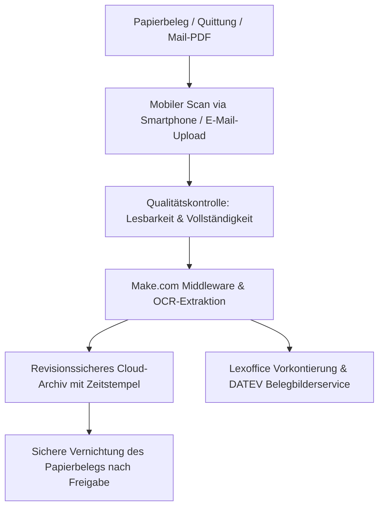

# 📜 Muster-Verfahrensdokumentation zur Digitalisierung und Aufbewahrung von Belegen (Ersetzendes Scannen)
**Gemäß den Grundsätzen zur ordnungsmäßigen Führung und Aufbewahrung von Büchern, Aufzeichnungen und Unterlagen in elektronischer Form sowie zum Datenzugriff (GoBD)**

**Unternehmen:** __________________________________________________  
**Standort:** __________________________________________________  
**Stand der Dokumentation:** _______________________________________  
**Erstellt durch:** KMU Service Harz UG (im Rahmen des Standard-Setups)  

---

## 1. Ziel und Anwendungsbereich
Diese Verfahrensdokumentation beschreibt den organisatorischen und technischen Prozess für das mobile und stationäre Erfassen (Scannen/Fotografieren), die optische Zeichenerkennung (OCR), die Vorkontierung und die revisionssichere Archivierung von Papierbelegen sowie digitalen Eingangsrechnungen im Unternehmen.

Ziel ist es, den Papierbeleg nach ordnungsgemäßem Scan- und Archivierungsvorgang vernichten zu können (**ersetzendes Scannen**), ohne die GoBD-Konformität oder den Vorsteuerabzug zu gefährden.

---

## 2. Der digitale Erfassungsprozess (Schritt für Schritt)

### Schritt 1: Erfassung (Erfassungszeitpunkt)
- **Wer:** Mitarbeiter vor Ort (z. B. auf Baustelle, Tankstelle) oder Backoffice-Personal.
- **Wie:** Foto per Smartphone-Kamera über den gesicherten Firmenkanal (WhatsApp Business / dediziertes Scan-Postfach) oder Weiterleitung digitaler PDFs.
- **Zeitpunkt:** Zeitnah, spätestens innerhalb von 3 Werktagen nach Erhalt des Belegs.

### Schritt 2: Sichtprüfung und Qualitätskontrolle
- Die erfassende Person prüft sofort:
  - Ist der Beleg vollständig sichtbar (keine abgeschnittenen Ränder)?
  - Sind Rechnungsbetrag, Aussteller, Datum und Steuersatz einwandfrei lesbar?
  - Liegt ein Duplikat vor?
- Bei unleserlichem Bild erfolgt sofortige Neuaufnahme.

### Schritt 3: Automatisierte Verarbeitung & Indizierung
- Die Middleware (Make.com) extrahiert Metadaten (Kreditor, Belegnummer, Datum, Bruttobetrag, USt.-Satz).
- Die Datei erhält einen unveränderbaren, eindeutigen Dateinamen nach dem Schema:  
  `YYYY-MM-DD_[Lieferant]_[Belegnummer].pdf`.

### Schritt 4: Revisionssichere Archivierung (GoBD-Speicher)
- Das Dokument wird in das unveränderbare Cloud-Archiv (Google Workspace / OneDrive / DATEV) übertragen.
- Es gilt ein striktes Lösch- und Überschreibverbot während der gesetzlichen Aufbewahrungsfrist (10 Jahre).

---

## 3. Aufbewahrung und Vernichtung des Papier-Originals
1. **Regelbelege (Kassenbons, Tankquittungen, Standard-Rechnungen):** Können nach erfolgreicher Übertragung in das GoBD-Archiv und Bestätigung der Vorkontierung im Buchhaltungssystem nach Ablauf von 4 Wochen vernichtet werden.
2. **Ausnahmen (Aufbewahrungspflicht im Original):**
   - Belege mit besonderen rechtlichen Formerfordernissen (z. B. notarielle Urkunden, Zolldokumente, Bürgschaften, Wertpapiere).
   - Belege, bei denen das Original für Beweiszwecke zwingend erforderlich ist.

---

## 4. Berechtigungs- und Sicherheitskonzept
- **Zugriffsschutz:** Zugriff auf das Archiv und das Buchhaltungssystem erhalten ausschließlich autorisierte Personen über personalisierte Zugänge mit 2-Faktor-Authentifizierung (2FA).
- **Änderungshistorie:** Alle Buchungsvorgänge und Belegzuordnungen werden im System lückenlos und manipulationssicher protokolliert.

---

## 5. Inkrafttreten und Aktualisierung
Diese Verfahrensdokumentation tritt am ____________________ in Kraft. Sie wird bei wesentlichen Änderungen der Hard- oder Software unverzüglich aktualisiert.

  
______________________________________ &nbsp;&nbsp;&nbsp;&nbsp;&nbsp;&nbsp;&nbsp;&nbsp;&nbsp;&nbsp;&nbsp;&nbsp;&nbsp;&nbsp;&nbsp;&nbsp; ______________________________________  
**Ort, Datum** &nbsp;&nbsp;&nbsp;&nbsp;&nbsp;&nbsp;&nbsp;&nbsp;&nbsp;&nbsp;&nbsp;&nbsp;&nbsp;&nbsp;&nbsp;&nbsp;&nbsp;&nbsp;&nbsp;&nbsp;&nbsp;&nbsp;&nbsp;&nbsp;&nbsp;&nbsp;&nbsp;&nbsp;&nbsp;&nbsp;&nbsp;&nbsp;&nbsp;&nbsp;&nbsp;&nbsp;&nbsp;&nbsp;&nbsp;&nbsp;&nbsp;&nbsp;&nbsp;&nbsp;&nbsp;&nbsp;&nbsp;&nbsp;&nbsp;&nbsp;&nbsp;&nbsp;&nbsp;&nbsp;&nbsp;&nbsp;&nbsp;&nbsp; **Unterschrift Geschäftsleitung**  
