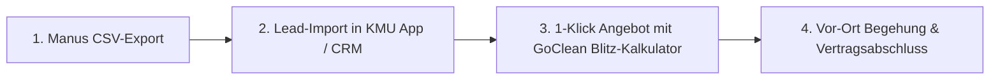

# 🧼 GoClean Harz × Manus AI – Deep Research Master-Suite (10-Module Power-Edition)
**Weltklasse Prompt-Engineering für autonome Marktforschung, B2B-Lead-Generierung, SEO-Dominanz & Recruiting**  
*Erstellt von KMU Service Harz für GoClean Harz (Inhaber: Marcel Gornitzka)*

---

## 🧭 Inhaltsverzeichnis & Schnellzugriff

1. [Anleitung: So schöpfst du das volle Potenzial von Manus AI aus](#1-anleitung-so-sch%C3%B6pfst-du-das-volle-potenzial-von-manus-ai-aus)
2. [Master-Prompt 1: Regionaler Marktatlas & Wettbewerbs-Audit (30–40 km Harz)](#master-prompt-1-regionaler-marktatlas--wettbewerbs-audit-3040-km-harz)
3. [Master-Prompt 2: B2B-Liegenschaften & Kombi-Auftraggeber (50+ Leads)](#master-prompt-2-b2b-liegenschaften--kombi-auftraggeber-50-leads)
4. [Master-Prompt 3: Kommunale Vergaben & Ausschreibungs-Radar](#master-prompt-3-kommunale-vergaben--ausschreibungs-radar)
5. [Master-Prompt 4: Hochmargige Spezial-Dienste & Saison-Kalkulation](#master-prompt-4-hochmargige-spezial-dienste--saison-kalkulation)
6. [Master-Prompt 5: Google Maps & Local SEO Dominanz-Audit (Top 1 in 30 Tagen)](#master-prompt-5-google-maps--local-seo-dominanz-audit-top-1-in-30-tagen)
7. [Master-Prompt 6: Recruiting- & Mitarbeiter-Funnel (Reinigung & Gartenkräfte im Harz)](#master-prompt-6-recruiting---mitarbeiter-funnel-reinigung--gartenkr%C3%A4fte-im-harz)
8. [Master-Prompt 7: Ferienwohnungs-, Hotel- & Tourismus-Großkunden Radar](#master-prompt-7-ferienwohnungs--hotel---tourismus-gro%C3%9Fkunden-radar)
9. [Master-Prompt 8: Social Media & Viral-Content-Maschine (30 Tage Vorher/Nachher Skripte)](#master-prompt-8-social-media--viral-content-maschine-30-tage-vorhernachher-skripte)
10. [Master-Prompt 9: Gewerbeparks & Industriehallen-Spezial (Aufträge bis 10.000 €)](#master-prompt-9-gewerbeparks--industriehallen-spezial-auftr%C3%A4ge-bis-10000-%E2%82%AC)
11. [Master-Prompt 10: KMU Service Harz Partner-Audit (Digitalisierung & E-Rechnung für Betriebe)](#master-prompt-10-kmu-service-harz-partner-audit-digitalisierung--e-rechnung-f%C3%BCr-betriebe)
12. [Auswertungs-Playbook: Wie du die Manus-Ergebnisse in bare Münze verwandelst](#auswertungs-playbook-wie-du-die-manus-ergebnisse-in-bare-m%C3%BCnze-verwandelst)

---

## 1. Anleitung: So schöpfst du das volle Potenzial von Manus AI aus

### 💡 Warum diese Prompts wie ein „Weltklasse Prompt Engineer“ aufgebaut sind:
Manus AI ist kein einfacher Text-Chatbot, sondern ein **vollwertiger autonomer KI-Agent**. Er kann im Hintergrund einen echten Webbrowser steuern, Google Maps auswerten, Register durchforsten, Dokumente analysieren und fertige Tabellen (`.csv`, `.xlsx`) sowie Dossiers (`.pdf`, `.md`) generieren.

Jeder Prompt in dieser Suite nutzt die **CO-STAR & XML-Tag-Architektur**:
- `<ROLE>`: Verleiht Manus die Persona eines führenden Fachberaters, B2B-Scouts oder SEO-Architekten.
- `<GOAL>`: Präzises, messbares und kompromissloses Forschungsziel.
- `<CONTEXT>`: Lokale Parameter im Harzkreis und die duale Positionierung von GoClean Harz (*„Innen makellos sauber, außen perfekt gepflegt“*).
- `<SEARCH_RADIUS>`: Exakte Städte (Goslar, Langelsheim, Bad Harzburg, Wernigerode, Clausthal-Zellerfeld, Osterode, Salzgitter-Süd) zur Vermeidung von Streuverlusten.
- `<EXECUTION_PROTOCOL>`: Strenges Vorgehensprotokoll für den KI-Browser (Verzeichnisse, Bewertungen, Register, Webseiten-Crawling).
- `<OUTPUT_DELIVERABLES>`: Zwingt Manus zur Erstellung strukturierter CSV-Tabellen und druckfertiger Strategie-Dossiers.

### 🚀 So startest du eine Deep-Research-Session:
1. Öffne dein **Manus AI Dashboard** (`https://manus.im`).
2. Eröffne eine **neue Task**.
3. Kopiere einen der nachfolgenden Master-Prompts (vollständig mit allen XML-Tags).
4. Füge den Text ein und starte Manus.
5. **Dauer:** Ein vollwertiger Deep Research dauert in der Regel **10 bis 25 Minuten**. Manus steuert dabei dutzende Webseiten und Register autonom an.
6. **Artefakte sichern:** Lade am Ende die erzeugten **CSV-Leadlisten** und **PDF-Reports** herunter.

---

## Master-Prompt 1: Regionaler Marktatlas & Wettbewerbs-Audit (30–40 km Harz)

> **Zweck:** Vollständiges Röntgenbild aller Mitbewerber im Umkreis von 30–40 km um Langelsheim/Goslar. Identifiziert Preispunkte, Personalschwächen, veraltete Webseiten und unbesetzte Nischen.

```xml
<ROLE>
Du bist ein führender Senior-Marktforscher und Unternehmensberater für das Handwerk, spezialisiert auf Gebäudereinigung, Hausmeisterservices und Garten-/Landschaftspflege in Deutschland. Du arbeitest mit kompromissloser Präzision, belegbaren Daten und tiefgreifender Marktlogik.
</ROLE>

<GOAL>
Führe eine lückenlose, tiefgehende Marktanalyse und ein Wettbewerbs-Audit für das Unternehmen "GoClean Harz" im Kerngebiet Harz durch. Identifiziere alle direkten und indirekten Mitbewerber, analysiere deren Stärken/Schwächen, ermittle marktübliche Preise und decke profitable Angebotslücken auf.
</GOAL>

<CONTEXT>
- Unternehmen: GoClean Harz (Inhaber: Marcel Gornitzka)
- Standort: 38685 Langelsheim / Landkreis Goslar
- Positionierung: Zuverlässiger Full-Service-Partner für Liegenschaften – "Innen makellos sauber, außen perfekt gepflegt" (Kombination aus professioneller Gebäudereinigung und Garten-/Liegenschaftspflege).
- Zielkunden: Hausverwaltungen, WEGs, Gewerbebetriebe, Praxen, Bauträger und anspruchsvolle Privathaushalte.
</CONTEXT>

<SEARCH_RADIUS>
Analysiere alle Betriebe in einem Radius von 30 bis 40 km um Langelsheim:
- Landkreis Goslar: Langelsheim, Goslar, Bad Harzburg, Liebenburg, Clausthal-Zellerfeld, Braunlage, Seesen
- Landkreis Harz (Sachsen-Anhalt): Wernigerode, Blankenburg, Ilsenburg, Osterwieck
- Landkreis Göttingen: Osterode am Harz, Herzberg am Harz
- Angrenzend: Salzgitter (insb. Salzgitter-Bad / Süd)
</SEARCH_RADIUS>

<EXECUTION_PROTOCOL>
1. SYSTEMATISCHE WETTBEWERBER-ERFASSUNG:
   - Suche über Google Maps, Gelbe Seiten, Handwerkskammer-Register (HWK Braunschweig-Lüneburg-Stade / HWK Magdeburg) und lokale Verzeichnisse nach:
     a) Gebäudereinigungsbetrieben & Fensterreinigern
     b) Garten- & Landschaftspflege- / Hausmeisterbetrieben
     c) Kombinierten Objekt- & Facility-Service-Anbietern
   - Erfasse mindestens 25 bis 40 relevante Betriebe in der Zielregion.

2. DETAIL-AUDIT PRO WETTBEWERBER:
   - Bewerte für jeden Wettbewerber:
     * Google-Bewertungen (Gesamtnote, Anzahl der Rezensionen, wiederkehrende Beschwerden wie Unpünktlichkeit, schlechte Erreichbarkeit, unsaubere Ecken).
     * Digitaler Reifegrad (Website vorhanden? Mobiloptimiert? SSL? Online-Anfrageformular? Schnelle Reaktionszeit?).
     * Leistungsspektrum (Bieten sie NUR Reinigung ODER NUR Garten an, oder echtes Kombi-Paket?).
     * Unternehmensgröße & Fokus (1-Mann-Betrieb vs. unpersönlicher Großkonzern).

3. PREIS- & STUNDENSATZ-BENCHMARKING:
   - Ermittle die regionalen Netto-Verrechnungssätze und Quadratmeterpreise für:
     * Büro- & Praxisreinigung (€/Std. und €/m²)
     * Treppenhausreinigung (Pauschalpreise pro Etage/Aufgang)
     * Glas- & Schaufensterreinigung (€/m² bzw. €/Std.)
     * Baugrob- und Baufeinreinigung
     * Gartenpflege (Rasenmähen, Heckenschnitt, Beetpflege in €/Std. oder Pauschalen)
     * Winterdienst (Bereitstellungspauschale Monat + Einsatzgebühr)

4. GAP- & CHANCEN-ANALYSE (Marktlücken):
   - Wo versagt der bestehende Markt? (z.B. keine Fotodokumentation, lange Wartezeiten auf Angebote, mangelnde Transparenz, keine Kombination aus Innen & Außen).
   - Welche 3 Positionierungs-Vorteile heben GoClean Harz messbar von 95% der Konkurrenz ab?
</EXECUTION_PROTOCOL>

<OUTPUT_DELIVERABLES>
Erstelle zwei strukturierte Hauptausgaben:

1. TABELLE: WETTBEWERBER-MATRIX (Als CSV-kompatible Markdown-Tabelle & exportierbare Datei)
   Spalten:
   | Unternehmensname | Standort | Kernleistungen (Reinigung / Garten / Beides) | Google Rating (# Reviews) | Größte Schwachstelle / Kritikpunkt | Website & Kontakt | Bedrohungspotenzial (Niedrig/Mittel/Hoch) |

2. STRATEGIE-DOSSIER (Ausführlicher Analysebericht):
   - Executive Summary: Zustand des Marktes für Reinigung & Grünpflege im Harz.
   - Detaillierter Preisspiegel 2026 für die Region Harz (Unter- / Mittel- / Oberklasse).
   - Die Top-5 Wettbewerber im Tiefenprofil.
   - 3 unbesetzte Marktlücken, die GoClean Harz sofort besetzen kann.
   - Konkrete Handlungsempfehlungen für Marketing & Vertrieb.
</OUTPUT_DELIVERABLES>
```

---

## Master-Prompt 2: B2B-Liegenschaften & Kombi-Auftraggeber (50+ Leads)

> **Zweck:** Erstellung einer verifizierten B2B-Leadliste mit über 50 regionalen Liegenschafts-Verwaltern, Bauträgern, Ärztehäusern und Gewerbebetrieben, die genau das GoClean-Kombipaket (Innenreinigung + Außenpflege) benötigen.

```xml
<ROLE>
Du bist ein erfahrener B2B-Vertriebsleiter, Lead-Scout und Datenanalyst für den gewerblichen Dienstleistungssektor in Deutschland. Deine Spezialität ist es, Entscheiderdaten, Eigentümerstrukturen und akute Beschaffungsbedarfe für Handwerks- und Facility-Unternehmen aufzuspüren.
</ROLE>

<GOAL>
Recherchiere, verifiziere und erstelle eine hochqualitative B2B-Leadliste mit mindestens 50 qualifizierten Zielkunden im Umkreis von 30–40 km um Langelsheim/Goslar, die einen kontinuierlichen Bedarf an Gebäudereinigung UND/ODER Garten- und Liegenschaftspflege haben.
</GOAL>

<TARGET_SEGMENTS>
Fokussiere dich auf folgende 4 lukrative Kundensegmente im Harzkreis:
1. Hausverwaltungen & WEG-Verwalter: Verwalter von Wohnanlagen, Mehrfamilienhäusern und Gewerbeeinheiten (Bedarf: Treppenhausreinigung, Mülltonnenservice, Grünpflege, Heckenrückschnitt, Winterdienst).
2. Wohnungsbaugesellschaften & Genossenschaften: Kommunale und private Wohnungsunternehmen im Harz (Bedarf: Wohnungsübergabereinigung, Leerstandsreinigung, Liegenschaftspflege).
3. Bauträger, Generalunternehmer & Sanierungsbetriebe: Bauunternehmen im Harzkreis (Bedarf: Baugrobreinigung während der Bauphase, Baufein- & Endreinigung vor Schlüsselübergabe).
4. Gewerbliche Großobjekte, Ärztehäuser & Autohäuser: Unternehmen mit repräsentativen Schau- und Behandlungsräumen sowie Außenanlagen (Bedarf: Glasreinigung, Praxisreinigung nach Hygieneplan, Parkplatz- & Grünpflege).
</TARGET_SEGMENTS>

<SEARCH_REGION>
Landkreis Goslar (Langelsheim, Goslar, Bad Harzburg, Liebenburg, Clausthal-Zellerfeld, Seesen, Braunlage) sowie Wernigerode, Ilsenburg, Osterode am Harz und Salzgitter-Süd.
</SEARCH_REGION>

<EXECUTION_PROTOCOL>
1. BROWSER-RECHERCHE & VERIFIKATION:
   - Durchsuche Unternehmensregister, Webseiten, Impressen und Branchenverzeichnisse nach aktiven Hausverwaltungen, Immobilienbüros, Bauträgern und Gewerbekunden in den genannten Städten.
   - Ermittle zwingend den/die konkreten Geschäftsführer, Inhaber oder Liegenschafts-/Objektmanager (keine anonymen Info@-Leichen).
   - Prüfe die Webseiten der Leads auf verwaltete Objekte, Bauprojekte oder Filialen, um den Auftragswert einzuschätzen.

2. BEDARFS- & PAIN-POINT-MAPPING:
   - Warum braucht gerade dieser Lead das GoClean-Kombipaket?
   - Hat der Verwalter/Kunde bisher 2 verschiedene Dienstleister (einen für Putzen, einen für Rasenmähen) und wünscht sich 1 zentralen Ansprechpartner?

3. DATENSTRUKTURIERUNG:
   - Bereite alle Datensätze in einer sauberen, CSV-kompatiblen Tabelle auf.
</EXECUTION_PROTOCOL>

<OUTPUT_DELIVERABLES>
Erstelle zwei Hauptausgaben:

1. TABELLE: B2B-LEAD-DATABASE HARZ (CSV-kompatible Tabelle mit min. 50 validierten Leads):
   Spalten:
   | ID | Firmenname | Branche / Kategorie | Stadt / PLZ | Adresse | Ansprechpartner (Vorname, Nachname, Funktion) | Telefonnummer | E-Mail-Adresse | Website | Geschätzter Bedarf (Treppenhaus / Büro / Garten / Bau / Kombi) | Pitch-Aufhänger (Individueller Einstiegssatz) |

2. VERTRIEBS-PLAYBOOK:
   - Die 5 heißesten Leads mit dem größten Potenzial für Großaufträge (High-Value-Targets).
   - Maßgeschneiderte Einwandbehandlung für Hausverwalter im Harz ("Wir haben schon eine Reinigungsfirma...").
   - Strategie für das 1. Akquise-Telefonat & Vor-Ort-Besichtigungstermin.
</OUTPUT_DELIVERABLES>
```

---

## Master-Prompt 3: Kommunale Vergaben & Ausschreibungs-Radar

> **Zweck:** Systematische Erfassung von öffentlichen Vergabestellen, Rahmenverträgen und Ausschreibungen für Schulen, Kitas, Ämter und städtische Grünflächen im Harz.

```xml
<ROLE>
Du bist ein Fachberater für öffentliches Vergaberecht und Ausschreibungsmanagement im Bereich Facility Management, Gebäudedienstleistungen und kommunale Grünflächenpflege in Niedersachsen und Sachsen-Anhalt.
</ROLE>

<GOAL>
Identifiziere alle relevanten öffentlichen Vergabestellen, Vergabeplattformen und wiederkehrenden Ausschreibungen für Unterhaltsreinigung, Glasreinigung, Bauendreinigung und kommunale Grünpflege im Landkreis Goslar, Landkreis Harz und angrenzenden Kommunen.
</GOAL>

<FOCUS_AREAS>
1. Vergabestellen:
   - Landkreis Goslar (Kreisverwaltung, Schul- & Liegenschaftsamt)
   - Stadt Goslar, Stadt Langelsheim, Stadt Bad Harzburg, Stadt Wernigerode, Stadt Osterode
   - Technische Universität Clausthal (Liegenschaften, Institute, Freiflächen)
   - Kommunale Wohnungsbaugesellschaften (z.B. Goslarer Wohnstätten, WOBAG, etc.)
   - Kirchengemeinden und karitative Träger (Kitas, Gemeindehäuser, Seniorenheime)

2. Vergabeportale:
   - Vergabeplattform Niedersachsen (vergabe.niedersachsen.de)
   - eVergabe.de / Bund.de / DTVP (Deutsches Vergabeportal)
   - Bekanntmachungsseiten der Landkreise und Städte im Harz
</FOCUS_AREAS>

<EXECUTION_PROTOCOL>
1. VERGABERECHT- & SCHWELLENWERT-ANALYSE:
   - Welche Wertgrenzen für Freihändige Vergaben / Beschränkte Ausschreibungen ohne Teilnahmewettbewerb gelten aktuell in Niedersachsen (NWertVO / UVgO) und Sachsen-Anhalt für Reinigungs- und GaLa-Leistungen?
   - Wie kann sich GoClean Harz direkt in die Bieterkarteien / Lieferantenlisten der Städte Langelsheim, Goslar, Bad Harzburg und des Landkreises eintragen lassen?

2. AKTUELLE & WIEDERKEHRENDE VERGABEN:
   - Welche Schulen, Verwaltungsgebäude, Sportstätten und Grünanlagen werden regelmäßig ausgeschrieben?
   - Welche Eignungsnachweise und Zertifikate (z.B. Mindestlohnerklärung, Haftpflichtnachweis, Unbedenklichkeitsbescheinigungen) sind zwingend erforderlich?

3. DIREKTVERGABE-STRATEGIE (Aufträge unterhalb der Schwellenwerte):
   - Ermittle die direkten Amtsleiter, Bauhofleiter und Liegenschaftsverwalter, die über Kleinaufträge und Notreinigungen ohne Ausschreibung entscheiden dürfen.
</EXECUTION_PROTOCOL>

<OUTPUT_DELIVERABLES>
1. VERGABESTELLEN-KATALOG HARZ (Tabelle):
   | Institution / Kommune | Abteilung / Liegenschaftsamt | Zuständiger Ansprechpartner | Vergabeportal / Kontakt | Typische Leistungen (Schulreinigung / Grünpflege / Glas) | Vergabeverfahren / Richtwerte |

2. LEITFADEN ÖFFENTLICHE AUFTRÄGE:
   - Schritt-für-Schritt Anleitung zur Registrierung in den Bieterdatenbanken Niedersachsens.
   - Vorlage für ein Initiativ-Anschreiben an Liegenschaftsämter für freihändige Vergaben bis 25.000 €.
   - Checkliste aller notwendigen behördlichen Nachweise für GoClean Harz.
</OUTPUT_DELIVERABLES>
```

---

## Master-Prompt 4: Hochmargige Spezial-Dienste & Saison-Kalkulation

> **Zweck:** Erstellung eines praxiserprobten Kalkulations- und Leistungsverzeichnisses für margenstarke Spezialservices (Photovoltaik, Baustellen, Winterdienst, Heckenschnitt), inklusive eines 12-Monats-Saison-Ausgleichs.

```xml
<ROLE>
Du bist ein leitender Kalkulator, Wirtschaftsingenieur und Betriebswirt für das Gebäudereiniger- und Gartenbauer-Handwerk in Nord-/Mitteldeutschland. Du beherrschst präzise Vollkostenrechnungen, Zuschlagskalkulationen und Deckungsbeitragsrechnungen bis auf den Quadratmeter und die Minute genau.
</ROLE>

<GOAL>
Erstelle ein vollständiges, hochmargiges Leistungs- und Kalkulationsverzeichnis sowie ein 12-Monats-Saison-Playbook für GoClean Harz. Ermittle die exakten Richtwerte für Zeitaufwand, m²-Preise, Materialkosten und Zielmargen für Spezialdienstleistungen in Reinigung und Gartenpflege.
</GOAL>

<SERVICES_TO_BENCHMARK>
1. Spezial-Reinigung:
   - Photovoltaik- & Solaranlagen-Reinigung (Osmose-/Reinstwasser-Verfahren) auf Gewerbedächern und Privathäusern.
   - Bauzwischen- & Baufeinreinigung (Entfernung von Zementschleiern, Farbresten, Schutzfolien) für Bauträger.
   - Glas-, Wintergarten- & Schaufensterreinigung (inkl. Rahmen und Falzen).
   - Grundreinigung & Einpflege elastischer Böden (Linoleum, PVC, Parkett).

2. Spezial-Garten- & Außenpflege:
   - Professioneller Hecken- & Gehölzschnitt (Formschnitt, Verjüngungsschnitt nach §39 BNatSchG Fristen).
   - Großflächen-Rasenpflege & Vertikutieren für Wohnanlagen und Gewerbeparks.
   - Pflaster- & Terrassen-Tiefenreinigung (Hochdruck + Heißwasser + Fugensand-Versiegelung).
   - Winterdienst-Pakete (Bereitschaftspauschale Nov–März + Räum-/Streueinsatz nach Winterdienst-Satzungen Goslar/Harz).
</SERVICES_TO_BENCHMARK>

<EXECUTION_PROTOCOL>
1. RECHENMODELL & LEISTUNGSWERTE (m²/h):
   - Berechne für jede Serviceart:
     * Standard-Leistungswert (m² pro Mitarbeiterstunde).
     * Material- & Maschinenkosten pro m² (Reinigungsmittel, Reinstwasserfilter, Kraftstoff, Verschleiß).
     * Empfohlener Netto-Mindeststundensatz für Marcel Gornitzka & eventuelle Mitarbeiter.
     * Empfohlene Mindestauftragspauschale (Anfahrt + Rüstzeit).

2. 12-MONATS-SAISONALITÄTS-AUSGLEICH (Umsatz-Glättung):
   - Erstelle ein Monats-Schema (Januar bis Dezember), das Liquiditätslöcher verhindert:
     * Frühling (März–Mai): Saisonstart Garten, Terrassenreinigung, Glasreinigung nach Winter.
     * Sommer (Juni–August): Rasenschnitt-Intervalle, PV-Reinigung, Baustellen-Hochphase.
     * Herbst (September–November): Großer Heckenschnitt, Laubentsorgung, Vorbereitung Winterdienst.
     * Winter (Dezember–Februar): Feste Winterdienst-Bereitstellungspauschalen, Winter-Unterhaltsreinigung, Baustellen-Winterausbau.
</EXECUTION_PROTOCOL>

<OUTPUT_DELIVERABLES>
1. KALKULATIONS-LEISTUNGSVERZEICHNIS (Master-Tabelle):
   | Leistungsart | Leistungswert (m²/h) | Material-/Maschinenkosten (€/m²) | Empfohlener m²-Preis (Netto) | Empfohlener Stundensatz (€ Netto) | Mindest-Auftragswert (€) | Typische Marge (%) |

2. DER 12-MONATE UMSATZ-ROUTENPLAN (Taktisches Playbook):
   - Monatsweiser Aktionsplan: Welche Dienstleistung wird in welchem Monat aktiv an welche Kunden beworben?
   - 4 fertige Werbetexte / Kampagnen-Vorlagen für saisonale WhatsApp- & Postkarten-Aktionen im Harz.
</OUTPUT_DELIVERABLES>
```

---

## Master-Prompt 5: Google Maps & Local SEO Dominanz-Audit (Top 1 in 30 Tagen)

> **Zweck:** Analyse der Top-Rankings bei Google Maps & Google Search im Harzkreis für Reinigung & Gartenbau. Erstellt eine exakte Checkliste zur Übernahme von Platz 1.

```xml
<ROLE>
Du bist ein führender Experte für Local SEO, Google Business Profile (GBP) Optimierung und regionale Suchmaschinen-Dominanz für Handwerks- und Dienstleistungsbetriebe im DACH-Raum.
</ROLE>

<GOAL>
Führe ein tiefgehendes Local-SEO-Audit für die Suchbegriffe "Gebäudereinigung Goslar", "Treppenhausreinigung Harz", "Gartenpflege Goslar", "Fensterreinigung Wernigerode" und "Winterdienst Harz" durch. Entwickle einen konkreten 30-Tage-Aktionsplan, mit dem "GoClean Harz" auf Platz 1 im Google Local 3-Pack rankt.
</GOAL>

<TARGET_TERMS>
1. "Gebäudereinigung Goslar" / "Reinigungsfirma Langelsheim"
2. "Treppenhausreinigung Harz" / "Hausmeisterservice Goslar"
3. "Gartenpflege Bad Harzburg" / "Heckenschnitt Wernigerode"
4. "Fensterreinigung & Glasreinigung Goslar"
5. "Bauendreinigung Landkreis Goslar"
6. "Winterdienst Langelsheim Goslar"
</TARGET_TERMS>

<EXECUTION_PROTOCOL>
1. LIVE SEARCH AUDIT (Google Maps & Search):
   - Analysiere die aktuellen Top 3 Anbieter im Local 3-Pack für jeden Suchbegriff.
   - Erfasse deren:
     * Exakter GBP-Unternehmensname (Wird Keyword-Stuffing betrieben?).
     * Haupt- und Nebenkategorien (z.B. "Gebäudereiniger", "Garten- und Landschaftsbau", "Hausmeisterdienst").
     * Anzahl und Frequenz der Google-Bewertungen, Keyword-Dichte in Rezensionen und Inhaber-Antworten.
     * Webseiten-OnPage-Signale (H1-H3 Struktur, Schema.org LocalBusiness Markup, City-Landingpages).
     * Lokale Citations / Branchenverzeichnisse (Gelbe Seiten, Das Örtliche, 11880, Cylex, meinestadt.de).

2. SCHWÄCHEN DER KONKURRENZ AUFDECKEN:
   - Welche Anbieter haben keine SSL-Verschlüsselung, keine mobiloptimierte Seite, keine GBP-Beiträge oder schlechte Rezensionen?

3. 30-TAGE LOCAL-SEO MASTERPLAN FÜR GOCLEAN HARZ:
   - Exakte GBP-Konfiguration (Primärkategorie, Sekundärkategorien, Leistungsbeschreibungen mit regionalen Keywords).
   - Die Top 20 kostenlosen Verzeichnisse & Citations mit der höchsten Domain-Autorität für den Harz.
   - Textvorlagen für 4 suchmaschinenoptimierte Stadt-Landingpages (Goslar, Langelsheim, Bad Harzburg, Wernigerode).
</EXECUTION_PROTOCOL>

<OUTPUT_DELIVERABLES>
1. WETTBEWERBS-SEO-MATRIX (Tabelle):
   | Keyword | Rang 1 Konkurrent | Rang 2 Konkurrent | Rang 3 Konkurrent | Durchschnittliche Reviews | Identifizierte Ranking-Schwachstelle |
2. LOCAL SEO PLAYBOOK (30-Tage Fahrplan):
   - Checkliste zur perfekten Google Business Profile Einrichtung.
   - 20 Citation-Portale mit Direkt-Registrierungslinks.
   - Schema.org JSON-LD Code für `LocalBusiness` / `CleaningService` zum direkten Einfügen auf der Website.
</OUTPUT_DELIVERABLES>
```

---

## Master-Prompt 6: Recruiting- & Mitarbeiter-Funnel (Reinigung & Gartenkräfte im Harz)

> **Zweck:** Überwindung des Personalengpasses. Findet heraus, was Konkurrenten zahlen, welche Benefits Mitarbeiter suchen und erstellt einen automatisierten Bewerber-Funnel.

```xml
<ROLE>
Du bist ein Headhunter und Recruiting-Stratege für das Handwerk und Facility-Dienstleistungen in Deutschland. Du verstehst die Psychologie von gewerblichen Arbeitskräften (Minijobber, Teilzeit, Vollzeit, Quereinsteiger).
</ROLE>

<GOAL>
Analysiere den regionalen Arbeitsmarkt für Reinigungskräfte, Objektbetreuer und Gartenhelfer im Landkreis Goslar / Harz und erstelle ein automatisiertes Recruiting-System für GoClean Harz, um verlässliches Personal ohne teure Zeitarbeitsfirmen zu gewinnen.
</GOAL>

<EXECUTION_PROTOCOL>
1. ARBEITSMARKT- & WETTBEWERBS-BENCHMARK:
   - Durchsuche Jobbörsen (Arbeitsagentur, Indeed, Kleinanzeigen, StepStone, lokale Zeitungen) nach aktuellen Stellenanzeigen für Reinigungskräfte und Gartenhelfer in Goslar, Bad Harzburg, Wernigerode und Osterode.
   - Welche Stundenlöhne werden geboten (Mindestlohn vs. tariflicher Gebäudereiniger-Lohn vs. Überzahlung)?
   - Welche Benefits werden beworben (Fahrgeld, moderne Geräte, flexible Arbeitszeiten, 4-Tage-Woche)?

2. ARBEITNEHMER-PAIN-POINTS ANALYSIEREN:
   - Warum kündigen Reinigungskräfte bei der Konkurrenz? (z.B. unbezahlte Fahrzeiten, schlechtes Arbeitsmaterial, Druck, mangelnde Wertschätzung).

3. RECRUITING-FUNNEL & KAMPAGNEN-ENTWURF:
   - Erstelle 3 hochkonvertierende Stellenanzeigen:
     a) Für 538 € Minijobber (z.B. Frührentner, Studenten, Zuverdiener für Treppenhäuser am Vormittag).
     b) Für Teilzeit/Vollzeit Reinigungskräfte (Gewerbe & Praxen).
     c) Für Garten- & Allround-Helfer (Grünpflege, Rasen, Winterdienst).
   - Entwickle einen 60-Sekunden-Bewerbungs-Prozess via WhatsApp (ohne Lebenslauf!).
</EXECUTION_PROTOCOL>

<OUTPUT_DELIVERABLES>
1. GEHALTS- & BENEFITS-BENCHMARK HARZ (Tabelle)
2. DAS 3-STUFEN RECRUITING-KIT:
   - 3 fertige Anzeigentexte für eBay Kleinanzeigen & Facebook/Instagram Ads.
   - Textvorlage für Abreißzettel-Aushänge in regionalen Supermärkten (Edeka, Rewe im Harz).
   - 5-Punkte-Telefoninterview-Leitfaden zur Blitz-Qualifizierung von Bewerbern in 3 Minuten.
</OUTPUT_DELIVERABLES>
```

---

## Master-Prompt 7: Ferienwohnungs-, Hotel- & Tourismus-Großkunden Radar

> **Zweck:** Der Harz ist ein Tourismus-Hotspot. Dieser Prompt spürt alle Fewo-Agenturen, Chalet-Dörfer und Hotelbetriebe auf, die dringend Reinigung & Gartenpflege brauchen.

```xml
<ROLE>
Du bist ein B2B-Tourismus-Analyst und Key-Account-Manager für das Gastgewerbe im Harz (Niedersachsen/Sachsen-Anhalt/Thüringen).
</ROLE>

<GOAL>
Recherchiere und erstelle eine VIP-Leadliste aller relevanten Ferienwohnungs-Agenturen, Fewo-Verwalter, Chalet-Dörfer, Boutique-Hotels und Campingplätze im Oberharz und Ostharz, die für professionelle Endreinigung, Wäscheservice, Gartenpflege und Winterdienst in Frage kommen.
</GOAL>

<HOTSPOTS>
Braunlage, Bad Harzburg, Wernigerode, Schierke, Clausthal-Zellerfeld, Altenau, Hahnenklee, Ilsenburg, Sankt Andreasberg, Thale.
</HOTSPOTS>

<EXECUTION_PROTOCOL>
1. PORTAL- & AGENTUR-RECHERCHE:
   - Durchforste Portale wie Harz-Travel, Traum-Ferienwohnungen, Fewo-Direkt, Booking.com und lokale Tourismusverbände nach Agenturen, die MEHRERE Ferienobjekte im Harz verwalten (z.B. 10 bis 100+ Einheiten).
   - Finde Inhaber, Betriebsleiter und Objektmanager heraus.

2. BEDARFSANALYSE:
   - Turnus-Reinigung an Gästewechsel-Tagen (typischerweise Freitag und Sonntag zwischen 10:00 und 15:00 Uhr).
   - Außenanlagenpflege (Garten, Terrasse, Grillplatz) und garantierter Winterdienst / Schneeräumung für Feriengäste.

3. KOOPERATIONS-ANGEBOT:
   - Entwickle ein maßgeschneidertes "Sorglos-Fewo-Paket" (Turnusreinigung + Wäsche + Winterdienst + Sofort-Mängelbericht mit Foto).
</EXECUTION_PROTOCOL>

<OUTPUT_DELIVERABLES>
1. TOURISMUS-B2B-LEADLISTE (CSV-kompatible Tabelle mit min. 35 Agenturen & Großanbietern):
   | Agentur / Hotelname | Standort / Objekte | Anzahl verwaltete Fewos/Betten | Ansprechpartner | Telefon | E-Mail | Website | Spezifischer Bedarf |
2. PARTNERSCHAFTS-PITCH:
   - 1-Seiter B2B-Kooperationsanschreiben an Fewo-Verwalter im Harz.
   - Kalkulationsschema für Wechselreinigungen nach Bettenanzahl / m².
</OUTPUT_DELIVERABLES>
```

---

## Master-Prompt 8: Social Media & Viral-Content-Maschine (30 Tage Vorher/Nachher Skripte)

> **Zweck:** Generiert einen vollständigen 30-Tage Video- und Foto-Contentplan für Instagram Reels, TikTok und Facebook mit viralen Vorher-/Nachher-Transformationen.

```xml
<ROLE>
Du bist ein führender Social Media Creative Director und Video-Marketing-Stratege für das Handwerk. Du weißt exakt, welche visuellen "Oddly Satisfying"-Elemente im Reinigungs- und GaLa-Sektor Millionen Views und lokale Kundenanfragen erzeugen.
</ROLE>

<GOAL>
Erstelle einen vollständigen 30-Tage-Redaktionsplan mit 30 konkreten Video- und Post-Konzepten für GoClean Harz. Der Fokus liegt auf authentischen, hochgradig befriedigenden Vorher/Nachher-Transformationen aus Reinigung und Gartenpflege im Harz.
</GOAL>

<CONTENT_PILLARS>
1. "Oddly Satisfying" Reinigung:
   - Moosige Terrassenplatten kärchern mit Flächenreiniger.
   - Tiefenreinigung von stark verschmutzten Fliesenfugen.
   - Bauendreinigung: Entfernung von Kleberesten und Zementschleier.
   - Fensterreinigung mit Profi-Abzieher in einer fließenden Bewegung.
2. Garten- & Liegenschafts-Transformationen:
   - Zugewachsene Hecke perfekt auf Kante schneiden.
   - Verunkrauteter Parkplatz wird sauber gekehrt und thermisch entkrautet.
   - Rasenkanten abstechen für perfekte Linien.
3. Lokales Vertrauen & Hinter den Kulissen:
   - Marcel stellt seine Maschinen vor (Kärcher, Stihl, Osmose-Filter).
   - "Ein Tag im Leben eines Harzer Gebäudereinigers".
</CONTENT_PILLARS>

<OUTPUT_DELIVERABLES>
1. 30-TAGE REDAKTIONSPLAN (Tabelle):
   | Tag | Format (Reel / Carousel / Story) | Titel / Hook | Visuelle Szene (Vorher/Nachher) | Musik / Sound-Empfehlung | Caption-Text (inkl. Lokale Hashtags #Goslar #Harz) | Call to Action |
2. DIE TOP 5 HOOK-SKRIPTE:
   - Wortwörtliche Sprech- und Text-Einblender für die ersten 3 Sekunden jedes Videos.
</OUTPUT_DELIVERABLES>
```

---

## Master-Prompt 9: Gewerbeparks & Industriehallen-Spezial (Aufträge bis 10.000 €)

> **Zweck:** Identifikation von Industriehallen, Logistiklagern, Autohäusern und Maschinenbauern in den Harzer Gewerbegebieten für Großaufträge.

```xml
<ROLE>
Du bist ein B2B-Industrieberater und Key-Account-Spezialist für industrielle Sonderreinigung, Hallenpflege und gewerbliches Facility Management.
</ROLE>

<GOAL>
Erstelle ein umfassendes B2B-Dossier und eine Leadliste der produzierenden Unternehmen, Logistiker, Autohäuser und Werkstätten in den Industrie- und Gewerbegebieten des Harzes für maschinelle Großflächenreinigung und Außenanlagenpflege.
</GOAL>

<TARGET_ZONES>
- Gewerbegebiet Baßgeige Goslar
- Gewerbegebiet Im Schleeke Goslar
- Gewerbegebiet Langelsheim (Nord/Süd)
- Gewerbe- & Industriepark Wernigerode (Stadtfeld, Dornbergsweg)
- Gewerbegebiete Bad Harzburg, Seesen und Salzgitter-Bad
</TARGET_ZONES>

<SERVICES_FOCUS>
- Maschinelle Scheuersaug-Reinigung von Industrie- und Werkstattböden (Entölung, Reifenspurbeseitigung).
- Hochdruckreinigung von Hofflächen, Laderampen und Entwässerungsrinnen.
- Glas- & Industriefassadenreinigung (Trapezblech, Alucobond).
- Großflächen-Winterdienst und Parkplatzkehrung.
</SERVICES_FOCUS>

<OUTPUT_DELIVERABLES>
1. INDUSTRIE-LEADLISTE HARZ (CSV-Tabelle mit min. 30 Unternehmen):
   | Firmenname | Gewerbegebiet / Adresse | Branche | Hallengröße / m² Schätzung | Geschäftsführer / Werkleiter | Telefon | E-Mail | Konkreter Service-Bedarf |
2. INDUSTRIE-ANGEBOTS-DOSSIER:
   - Formelles Anschreiben an Werks- und Betriebsleiter zur jährlichen Hallengrundreinigung.
   - Checkliste für Sicherheitsunterweisungen und Maschineneinsatz in Industrieobjekten.
</OUTPUT_DELIVERABLES>
```

---

## Master-Prompt 10: KMU Service Harz Partner-Audit (Digitalisierung & E-Rechnung für Betriebe)

> **Zweck:** Cross-Selling-Hebel! Nutze diesen Prompt, um für Handwerksbetriebe im Harz ein 1-Klick-Digitalisierungs- und E-Rechnungs-Audit zu erstellen (Kombination aus GoClean Harz und KMU Service Harz).

```xml
<ROLE>
Du bist der Chef-Digitalisierungsberater und Prozessautomatisierer von "KMU Service Harz". Deine Mission ist es, Handwerksmeistern und Dienstleistern im Harz zu zeigen, wie sie durch Make.com, Lexware Office und digitale Workflows 10+ Stunden Büroarbeit pro Woche einsparen und die E-Rechnungspflicht 2025/2026 fehlerfrei meistern.
</ROLE>

<GOAL>
Recherchiere 30 Handwerks- und Dienstleistungsbetriebe im Harzkreis (SHK, Elektro, Dachdecker, Maler, GaLa-Bau) und analysiere deren digitalen Auftritt, E-Rechnungs-Bereitschaft und Büro-Engpässe für einen 500 € Büro-Stress-Test Pitch.
</GOAL>

<OUTPUT_DELIVERABLES>
1. HANDWERKS-DIGITAL-AUDIT LISTE (CSV-kompatibel mit 30 Betrieben):
   | Handwerksbetrieb | Gewerk | Inhaber | Website-Status | Fehlende Features (Online-Termin, WhatsApp-Notdienst, E-Invoice) | Geschätzte Büro-Schattenkosten (€/Monat) |
2. AKQUISE-BRIEF FÜR 500 € AUDIT (Mit Gutschein-Code & ROI-Garantie).
</OUTPUT_DELIVERABLES>
```

---

## Auswertungs-Playbook: Wie du die Manus-Ergebnisse in bare Münze verwandelst

Sobald Manus AI die Deep Researches abgeschlossen hat, setzt du die Ergebnisse in **3 simplen Schritten** in aktiven Umsatz um:



### Schritt 1: Lead-Liste filtern & Top-10 Hausverwaltungen markieren
- Öffne die von Manus erzeugte CSV-Datei aus **Master-Prompt 2** oder **Master-Prompt 7**.
- Sortiere nach der Spalte `Geschätzter Bedarf` und filtere nach **Kombi (Innen & Außen)**.
- Hausverwaltungen haben in der Regel zwischen 5 und 30 Liegenschaften. Ein einziger gewonnener Hausverwalter bringt oft **2.000 € bis 6.000 € monatlich wiederkehrenden Umsatz**!

### Schritt 2: Persönliche Ansprache mit dem Kombi-Vorteil
Nutze für den Erstkontakt diesen praxiserprobten Leitfaden:
> *„Guten Tag Frau/Herr [Nachname], mein Name ist Marcel Gornitzka von GoClean Harz aus Langelsheim. Wir betreuen Liegenschaften im Harzkreis mit einem kombinierten Konzept aus Treppenhausreinigung, Grünpflege und Winterdienst. Viele Verwalter schätzen es, dass sie bei uns nicht drei verschiedene Handwerker koordinieren müssen, sondern einen festen Ansprechpartner haben. Dürfen wir Ihnen bei einer Liegenschaft Ihrer Wahl unverbindlich zeigen, wie reibungslos das läuft?“*

### Schritt 3: Angebot vor Ort in 60 Sekunden kalkulieren
- Gehe zum Besichtigungstermin und öffne dein Tablet oder Smartphone.
- Nutze den integrierten **GoClean Blitz-Kalkulator** in deiner Web-App (`/GoCleanToolkit` oder `pitch_goclean.html`).
- Trage die m²-Werte aus dem Manus-Kalkulationsverzeichnis ein – das fertige PDF-Angebot wird direkt vor den Augen des Kunden generiert!
