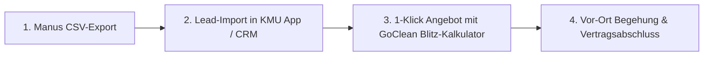

# 🧼 GoClean Harz × Manus AI – Deep Research Master-Suite
**Weltklasse Prompt-Engineering für autonome Marktforschung, B2B-Lead-Generierung & Margen-Optimierung**  
*Erstellt von KMU Service Harz für GoClean Harz (Inhaber: Marcel Gornitzka)*

---

## 🧭 Inhaltsverzeichnis & Schnellzugriff

1. [Anleitung: So führst du die Prompts in Manus AI aus](#1-anleitung-so-f%C3%BChrst-du-die-prompts-in-manus-ai-aus)
2. [Master-Prompt 1: Regionaler Marktatlas & Wettbewerbs-Audit (30–40 km Harz)](#master-prompt-1-regionaler-marktatlas--wettbewerbs-audit-3040-km-harz)
3. [Master-Prompt 2: B2B-Liegenschaften & Kombi-Auftraggeber (50+ Leads)](#master-prompt-2-b2b-liegenschaften--kombi-auftraggeber-50-leads)
4. [Master-Prompt 3: Kommunale Vergaben & Ausschreibungs-Radar](#master-prompt-3-kommunale-vergaben--ausschreibungs-radar)
5. [Master-Prompt 4: Hochmargige Spezial-Dienste & Saison-Kalkulation](#master-prompt-4-hochmargige-spezial-dienste--saison-kalkulation)
6. [Auswertungs-Playbook: Wie du die Manus-Ergebnisse in Umsatz verwandelst](#6-auswertungs-playbook-wie-du-die-manus-ergebnisse-in-umsatz-verwandelst)

---

## 1. Anleitung: So führst du die Prompts in Manus AI aus

### 💡 Warum diese Prompts wie ein „Weltklasse Prompt Engineer“ aufgebaut sind:
Manus AI ist kein einfacher Chatbot, sondern ein **autonomer Agent**. Er kann selbstständig Browserfenster öffnen, Google Maps durchsuchen, Webseiten analysieren, PDFs herunterladen und strukturierte Tabellen (CSV/Excel) erstellen.

Damit Manus maximale Tiefe liefert und nicht nach 2 Minuten oberflächlich abbricht, nutzen diese Prompts die **CO-STAR & XML-Tag-Architektur**:
- `<ROLE>`: Definiert Manus als Senior-Marktanalyst & B2B-Stratege für Handwerk & Gebäudedienstleistungen.
- `<GOAL>`: Präzises, messbares Forschungsziel ohne Interpretationsspielraum.
- `<CONTEXT>`: Lokale Gegebenheiten im Harzkreis und die duale Positionierung von GoClean Harz (Reinigung **UND** Garten-/Objektpflege).
- `<SEARCH_RADIUS>`: Exakte Städte und Postleitzahlen zur Vermeidung von Streuverlusten.
- `<EXECUTION_PROTOCOL>`: Schritt-für-Schritt-Vorgehen für den KI-Browser.
- `<OUTPUT_SCHEMA>`: Erzwingt strukturierte Tabellen (CSV-kompatibel) und strategische Zusammenfassungen.

### 🚀 Schritt-für-Schritt-Durchführung:
1. Öffne dein **Manus AI Dashboard** (`https://manus.im` oder deine Manus-Oberfläche).
2. Eröffne eine **neue Task / Session**.
3. Kopiere den gewünschten Master-Prompt aus den untenstehenden Code-Blöcken (1 zu 1 mit allen XML-Tags).
4. Füge den Text in Manus ein und starte die Ausführung.
5. **Wartezeit:** Ein Deep-Research-Durchlauf dauert ca. **10 bis 25 Minuten**, da Manus hunderte Webseiten, Register und Google-Maps-Einträge live ansteuert.
6. **Download:** Lade nach Abschluss sowohl den **Markdown/PDF-Bericht** als auch die generierte **CSV- oder Excel-Tabelle** herunter.

---

## Master-Prompt 1: Regionaler Marktatlas & Wettbewerbs-Audit (30–40 km Harz)

> **Zweck:** Vollständiges Röntgenbild aller Mitbewerber im Umkreis von 30–40 km um Langelsheim/Goslar. Identifiziert Preispunkte, Personalschwächen, veraltete Webseiten und unbesetzte Nischen.

```xml
<ROLE>
Du bist ein führender Senior-Marktforscher und Unternehmensberater für das Handwerk, spezialisiert auf Gebäudereinigung, Hausmeisterservices und Garten-/Landschaftspflege in Deutschland. Du arbeitest mit kompromissloser Präzision, belegbaren Daten und tiefgreifender Marktlogik.
</ROLE>

<GOAL>
Führe eine lückenlose, tiefgehende Marktanalyse und ein Wettbewerbs-Audit für das Unternehmen "GoClean Harz" im Kerngebiet Harz durch. Identifiziere alle direkten und indirekten Mitbewerber, analysiere deren Stärken/Schwächen, ermittle marktübliche Preise und decke profitable Angebotslücken auf.
</GOAL>

<CONTEXT>
- Unternehmen: GoClean Harz (Inhaber: Marcel Gornitzka)
- Standort: 38685 Langelsheim / Landkreis Goslar
- Positionierung: Zuverlässiger Full-Service-Partner für Liegenschaften – "Innen makellos sauber, außen perfekt gepflegt" (Kombination aus professioneller Gebäudereinigung und Garten-/Liegenschaftspflege).
- Zielkunden: Hausverwaltungen, WEGs, Gewerbebetriebe, Praxen, Bauträger und anspruchsvolle Privathaushalte.
</CONTEXT>

<SEARCH_RADIUS>
Analysiere alle Betriebe in einem Radius von 30 bis 40 km um Langelsheim:
- Landkreis Goslar: Langelsheim, Goslar, Bad Harzburg, Liebenburg, Clausthal-Zellerfeld, Braunlage, Seesen
- Landkreis Harz (Sachsen-Anhalt): Wernigerode, Blankenburg, Ilsenburg, Osterwieck
- Landkreis Göttingen: Osterode am Harz, Herzberg am Harz
- Angrenzend: Salzgitter (insb. Salzgitter-Bad / Süd)
</SEARCH_RADIUS>

<EXECUTION_PROTOCOL>
1. SYSTEMATISCHE WETTBEWERBER-ERFASSUNG:
   - Suche über Google Maps, Gelbe Seiten, Handwerkskammer-Register (HWK Braunschweig-Lüneburg-Stade / HWK Magdeburg) und lokale Verzeichnisse nach:
     a) Gebäudereinigungsbetrieben & Fensterreinigern
     b) Garten- & Landschaftspflege- / Hausmeisterbetrieben
     c) Kombinierten Objekt- & Facility-Service-Anbietern
   - Erfasse mindestens 25 bis 40 relevante Betriebe in der Zielregion.

2. DETAIL-AUDIT PRO WETTBEWERBER:
   - Bewerte für jeden Wettbewerber:
     * Google-Bewertungen (Gesamtnote, Anzahl der Rezensionen, wiederkehrende Beschwerden wie Unpünktlichkeit, schlechte Erreichbarkeit, unsaubere Ecken).
     * Digitaler Reifegrad (Website vorhanden? Mobiloptimiert? SSL? Online-Anfrageformular? Schnelle Reaktionszeit?).
     * Leistungsspektrum (Bieten sie NUR Reinigung ODER NUR Garten an, oder echtes Kombi-Paket?).
     * Unternehmensgröße & Fokus (1-Mann-Betrieb vs. unpersönlicher Großkonzern).

3. PREIS- & STUNDENSATZ-BENCHMARKING:
   - Ermittle die regionalen Netto-Verrechnungssätze und Quadratmeterpreise für:
     * Büro- & Praxisreinigung (€/Std. und €/m²)
     * Treppenhausreinigung (Pauschalpreise pro Etage/Aufgang)
     * Glas- & Schaufensterreinigung (€/m² bzw. €/Std.)
     * Baugrob- und Baufeinreinigung
     * Gartenpflege (Rasenmähen, Heckenschnitt, Beetpflege in €/Std. oder Pauschalen)
     * Winterdienst (Bereitstellungspauschale Monat + Einsatzgebühr)

4. GAP- & CHANCEN-ANALYSE (Marktlücken):
   - Wo versagt der bestehende Markt? (z.B. keine Fotodokumentation, lange Wartezeiten auf Angebote, mangelnde Transparenz, keine Kombination aus Innen & Außen).
   - Welche 3 Positionierungs-Vorteile heben GoClean Harz messbar von 95% der Konkurrenz ab?
</EXECUTION_PROTOCOL>

<OUTPUT_DELIVERABLES>
Erstelle zwei strukturierte Hauptausgaben:

1. TABELLE: WETTBEWERBER-MATRIX (Als CSV-kompatible Markdown-Tabelle & exportierbare Datei)
   Spalten:
   | Unternehmensname | Standort | Kernleistungen (Reinigung / Garten / Beides) | Google Rating (# Reviews) | Größte Schwachstelle / Kritikpunkt | Website & Kontakt | Bedrohungspotenzial (Niedrig/Mittel/Hoch) |

2. STRATEGIE-DOSSIER (Ausführlicher Analysebericht):
   - Executive Summary: Zustand des Marktes für Reinigung & Grünpflege im Harz.
   - Detaillierter Preisspiegel 2026 für die Region Harz (Unter- / Mittel- / Oberklasse).
   - Die Top-5 Wettbewerber im Tiefenprofil.
   - 3 unbesetzte Marktlücken, die GoClean Harz sofort besetzen kann.
   - Konkrete Handlungsempfehlungen für Marketing & Vertrieb.
</OUTPUT_DELIVERABLES>
```

---

## Master-Prompt 2: B2B-Liegenschaften & Kombi-Auftraggeber (50+ Leads)

> **Zweck:** Erstellung einer verifizierten B2B-Leadliste mit über 50 regionalen Liegenschafts-Verwaltern, Bauträgern, Ärztehäusern und Gewerbebetrieben, die genau das GoClean-Kombipaket (Innenreinigung + Außenpflege) benötigen.

```xml
<ROLE>
Du bist ein erfahrener B2B-Vertriebsleiter, Lead-Scout und Datenanalyst für den gewerblichen Dienstleistungssektor in Deutschland. Deine Spezialität ist es, Entscheiderdaten, Eigentümerstrukturen und akute Beschaffungsbedarfe für Handwerks- und Facility-Unternehmen aufzuspüren.
</ROLE>

<GOAL>
Recherchiere, verifiziere und erstelle eine hochqualitative B2B-Leadliste mit mindestens 50 qualifizierten Zielkunden im Umkreis von 30–40 km um Langelsheim/Goslar, die einen kontinuierlichen Bedarf an Gebäudereinigung UND/ODER Garten- und Liegenschaftspflege haben.
</GOAL>

<TARGET_SEGMENTS>
Fokussiere dich auf folgende 4 lukrative Kundensegmente im Harzkreis:
1. Hausverwaltungen & WEG-Verwalter: Verwalter von Wohnanlagen, Mehrfamilienhäusern und Gewerbeeinheiten (Bedarf: Treppenhausreinigung, Mülltonnenservice, Grünpflege, Heckenrückschnitt, Winterdienst).
2. Wohnungsbaugesellschaften & Genossenschaften: Kommunale und private Wohnungsunternehmen im Harz (Bedarf: Wohnungsübergabereinigung, Leerstandsreinigung, Liegenschaftspflege).
3. Bauträger, Generalunternehmer & Sanierungsbetriebe: Bauunternehmen im Harzkreis (Bedarf: Baugrobreinigung während der Bauphase, Baufein- & Endreinigung vor Schlüsselübergabe).
4. Gewerbliche Großobjekte, Ärztehäuser & Autohäuser: Unternehmen mit repräsentativen Schau- und Behandlungsräumen sowie Außenanlagen (Bedarf: Glasreinigung, Praxisreinigung nach Hygieneplan, Parkplatz- & Grünpflege).
</TARGET_SEGMENTS>

<SEARCH_REGION>
Landkreis Goslar (Langelsheim, Goslar, Bad Harzburg, Liebenburg, Clausthal-Zellerfeld, Seesen, Braunlage) sowie Wernigerode, Ilsenburg, Osterode am Harz und Salzgitter-Süd.
</SEARCH_REGION>

<EXECUTION_PROTOCOL>
1. BROWSER-RECHERCHE & VERIFIKATION:
   - Durchsuche Unternehmensregister, Webseiten, Impressen und Branchenverzeichnisse nach aktiven Hausverwaltungen, Immobilienbüros, Bauträgern und Gewerbekunden in den genannten Städten.
   - Ermittle zwingend den/die konkreten Geschäftsführer, Inhaber oder Liegenschafts-/Objektmanager (keine anonymen Info@-Leichen).
   - Prüfe die Webseiten der Leads auf verwaltete Objekte, Bauprojekte oder Filialen, um den Auftragswert einzuschätzen.

2. BEDARFS- & PAIN-POINT-MAPPING:
   - Warum braucht gerade dieser Lead das GoClean-Kombipaket?
   - Hat der Verwalter/Kunde bisher 2 verschiedene Dienstleister (einen für Putzen, einen für Rasenmähen) und wünscht sich 1 zentralen Ansprechpartner?

3. DATENSTRUKTURIERUNG:
   - Bereite alle Datensätze in einer sauberen, CSV-kompatiblen Tabelle auf.
</EXECUTION_PROTOCOL>

<OUTPUT_DELIVERABLES>
Erstelle zwei Hauptausgaben:

1. TABELLE: B2B-LEAD-DATABASE HARZ (CSV-kompatible Tabelle mit min. 50 validierten Leads):
   Spalten:
   | ID | Firmenname | Branche / Kategorie | Stadt / PLZ | Adresse | Ansprechpartner (Vorname, Nachname, Funktion) | Telefonnummer | E-Mail-Adresse | Website | Geschätzter Bedarf (Treppenhaus / Büro / Garten / Bau / Kombi) | Pitch-Aufhänger (Individueller Einstiegssatz) |

2. VERTRIEBS-PLAYBOOK:
   - Die 5 heißesten Leads mit dem größten Potenzial für Großaufträge (High-Value-Targets).
   - Maßgeschneiderte Einwandbehandlung für Hausverwalter im Harz ("Wir haben schon eine Reinigungsfirma...").
   - Strategie für das 1. Akquise-Telefonat & Vor-Ort-Besichtigungstermin.
</OUTPUT_DELIVERABLES>
```

---

## Master-Prompt 3: Kommunale Vergaben & Ausschreibungs-Radar

> **Zweck:** Systematische Erfassung von öffentlichen Vergabestellen, Rahmenverträgen und Ausschreibungen für Schulen, Kitas, Ämter und städtische Grünflächen im Harz.

```xml
<ROLE>
Du bist ein Fachberater für öffentliches Vergaberecht und Ausschreibungsmanagement im Bereich Facility Management, Gebäudedienstleistungen und kommunale Grünflächenpflege in Niedersachsen und Sachsen-Anhalt.
</ROLE>

<GOAL>
Identifiziere alle relevanten öffentlichen Vergabestellen, Vergabeplattformen und wiederkehrenden Ausschreibungen für Unterhaltsreinigung, Glasreinigung, Bauendreinigung und kommunale Grünpflege im Landkreis Goslar, Landkreis Harz und angrenzenden Kommunen.
</GOAL>

<FOCUS_AREAS>
1. Vergabestellen:
   - Landkreis Goslar (Kreisverwaltung, Schul- & Liegenschaftsamt)
   - Stadt Goslar, Stadt Langelsheim, Stadt Bad Harzburg, Stadt Wernigerode, Stadt Osterode
   - Technische Universität Clausthal (Liegenschaften, Institute, Freiflächen)
   - Kommunale Wohnungsbaugesellschaften (z.B. Goslarer Wohnstätten, WOBAG, etc.)
   - Kirchengemeinden und karitative Träger (Kitas, Gemeindehäuser, Seniorenheime)

2. Vergabeportale:
   - Vergabeplattform Niedersachsen (vergabe.niedersachsen.de)
   - eVergabe.de / Bund.de / DTVP (Deutsches Vergabeportal)
   - Bekanntmachungsseiten der Landkreise und Städte im Harz
</FOCUS_AREAS>

<EXECUTION_PROTOCOL>
1. VERGABERECHT- & SCHWELLENWERT-ANALYSE:
   - Welche Wertgrenzen für Freihändige Vergaben / Beschränkte Ausschreibungen ohne Teilnahmewettbewerb gelten aktuell in Niedersachsen (NWertVO / UVgO) und Sachsen-Anhalt für Reinigungs- und GaLa-Leistungen?
   - Wie kann sich GoClean Harz direkt in die Bieterkarteien / Lieferantenlisten der Städte Langelsheim, Goslar, Bad Harzburg und des Landkreises eintragen lassen?

2. AKTUELLE & WIEDERKEHRENDE VERGABEN:
   - Welche Schulen, Verwaltungsgebäude, Sportstätten und Grünanlagen werden regelmäßig ausgeschrieben?
   - Welche Eignungsnachweise und Zertifikate (z.B. Mindestlohnerklärung, Haftpflichtnachweis, Unbedenklichkeitsbescheinigungen) sind zwingend erforderlich?

3. DIREKTVERGABE-STRATEGIE (Aufträge unterhalb der Schwellenwerte):
   - Ermittle die direkten Amtsleiter, Bauhofleiter und Liegenschaftsverwalter, die über Kleinaufträge und Notreinigungen ohne Ausschreibung entscheiden dürfen.
</EXECUTION_PROTOCOL>

<OUTPUT_DELIVERABLES>
1. VERGABESTELLEN-KATALOG HARZ (Tabelle):
   | Institution / Kommune | Abteilung / Liegenschaftsamt | Zuständiger Ansprechpartner | Vergabeportal / Kontakt | Typische Leistungen (Schulreinigung / Grünpflege / Glas) | Vergabeverfahren / Richtwerte |

2. LEITFADEN ÖFFENTLICHE AUFTRÄGE:
   - Schritt-für-Schritt Anleitung zur Registrierung in den Bieterdatenbanken Niedersachsens.
   - Vorlage für ein Initiativ-Anschreiben an Liegenschaftsämter für freihändige Vergaben bis 25.000 €.
   - Checkliste aller notwendigen behördlichen Nachweise für GoClean Harz.
</OUTPUT_DELIVERABLES>
```

---

## Master-Prompt 4: Hochmargige Spezial-Dienste & Saison-Kalkulation

> **Zweck:** Erstellung eines praxiserprobten Kalkulations- und Leistungsverzeichnisses für margenstarke Spezialservices (Photovoltaik, Baustellen, Winterdienst, Heckenschnitt), inklusive eines 12-Monats-Saison-Ausgleichs.

```xml
<ROLE>
Du bist ein leitender Kalkulator, Wirtschaftsingenieur und Betriebswirt für das Gebäudereiniger- und Gartenbauer-Handwerk in Nord-/Mitteldeutschland. Du beherrschst präzise Vollkostenrechnungen, Zuschlagskalkulationen und Deckungsbeitragsrechnungen bis auf den Quadratmeter und die Minute genau.
</ROLE>

<GOAL>
Erstelle ein vollständiges, hochmargiges Leistungs- und Kalkulationsverzeichnis sowie ein 12-Monats-Saison-Playbook für GoClean Harz. Ermittle die exakten Richtwerte für Zeitaufwand, m²-Preise, Materialkosten und Zielmargen für Spezialdienstleistungen in Reinigung und Gartenpflege.
</GOAL>

<SERVICES_TO_BENCHMARK>
1. Spezial-Reinigung:
   - Photovoltaik- & Solaranlagen-Reinigung (Osmose-/Reinstwasser-Verfahren) auf Gewerbedächern und Privathäusern.
   - Bauzwischen- & Baufeinreinigung (Entfernung von Zementschleiern, Farbresten, Schutzfolien) für Bauträger.
   - Glas-, Wintergarten- & Schaufensterreinigung (inkl. Rahmen und Falzen).
   - Grundreinigung & Einpflege elastischer Böden (Linoleum, PVC, Parkett).

2. Spezial-Garten- & Außenpflege:
   - Professioneller Hecken- & Gehölzschnitt (Formschnitt, Verjüngungsschnitt nach §39 BNatSchG Fristen).
   - Großflächen-Rasenpflege & Vertikutieren für Wohnanlagen und Gewerbeparks.
   - Pflaster- & Terrassen-Tiefenreinigung (Hochdruck + Heißwasser + Fugensand-Versiegelung).
   - Winterdienst-Pakete (Bereitschaftspauschale Nov–März + Räum-/Streueinsatz nach Winterdienst-Satzungen Goslar/Harz).
</SERVICES_TO_BENCHMARK>

<EXECUTION_PROTOCOL>
1. RECHENMODELL & LEISTUNGSWERTE (m²/h):
   - Berechne für jede Serviceart:
     * Standard-Leistungswert (m² pro Mitarbeiterstunde).
     * Material- & Maschinenkosten pro m² (Reinigungsmittel, Reinstwasserfilter, Kraftstoff, Verschleiß).
     * Empfohlener Netto-Mindeststundensatz für Christian Gornitzka & eventuelle Mitarbeiter.
     * Empfohlene Mindestauftragspauschale (Anfahrt + Rüstzeit).

2. 12-MONATS-SAISONALITÄTS-AUSGLEICH (Umsatz-Glättung):
   - Erstelle ein Monats-Schema (Januar bis Dezember), das Liquiditätslöcher verhindert:
     * Frühling (März–Mai): Saisonstart Garten, Terrassenreinigung, Glasreinigung nach Winter.
     * Sommer (Juni–August): Rasenschnitt-Intervalle, PV-Reinigung, Baustellen-Hochphase.
     * Herbst (September–November): Großer Heckenschnitt, Laubentsorgung, Vorbereitung Winterdienst.
     * Winter (Dezember–Februar): Feste Winterdienst-Bereitstellungspauschalen, Winter-Unterhaltsreinigung, Baustellen-Winterausbau.
</EXECUTION_PROTOCOL>

<OUTPUT_DELIVERABLES>
1. KALKULATIONS-LEISTUNGSVERZEICHNIS (Master-Tabelle):
   | Leistungsart | Leistungswert (m²/h) | Material-/Maschinenkosten (€/m²) | Empfohlener m²-Preis (Netto) | Empfohlener Stundensatz (€ Netto) | Mindest-Auftragswert (€) | Typische Marge (%) |

2. DER 12-MONATE UMSATZ-ROUTENPLAN (Taktisches Playbook):
   - Monatsweiser Aktionsplan: Welche Dienstleistung wird in welchem Monat aktiv an welche Kunden beworben?
   - 4 fertige Werbetexte / Kampagnen-Vorlagen für saisonale WhatsApp- & Postkarten-Aktionen im Harz.
</OUTPUT_DELIVERABLES>
```

---

## 6. Auswertungs-Playbook: Wie du die Manus-Ergebnisse in Umsatz verwandelst

Sobald Manus AI die Deep Researches abgeschlossen hat, setzt du die Ergebnisse in **3 simplen Schritten** in aktiven Umsatz um:



### Schritt 1: Lead-Liste filtern & Top-10 Hausverwaltungen markieren
- Öffne die von Manus erzeugte CSV-Datei aus **Master-Prompt 2**.
- Sortiere nach der Spalte `Geschätzter Bedarf` und filtere nach **Kombi (Innen & Außen)**.
- Hausverwaltungen haben in der Regel zwischen 5 und 30 Liegenschaften. Ein einziger gewonnener Hausverwalter bringt oft **2.000 € bis 6.000 € monatlich wiederkehrenden Umsatz**!

### Schritt 2: Persönliche Ansprache mit dem Kombi-Vorteil
Nutze für den Erstkontakt diesen praxiserprobten Leitfaden:
> *„Guten Tag Frau/Herr [Nachname], mein Name ist Christian Gornitzka von GoClean Harz aus Langelsheim. Wir betreuen Liegenschaften im Harzkreis mit einem kombinierten Konzept aus Treppenhausreinigung, Grünpflege und Winterdienst. Viele Verwalter schätzen es, dass sie bei uns nicht drei verschiedene Handwerker koordinieren müssen, sondern einen festen Ansprechpartner haben. Dürfen wir Ihnen bei einer Liegenschaft Ihrer Wahl unverbindlich zeigen, wie reibungslos das läuft?“*

### Schritt 3: Angebot vor Ort in 60 Sekunden kalkulieren
- Gehe zum Besichtigungstermin und öffne dein Tablet oder Smartphone.
- Nutze den integrierten **GoClean Blitz-Kalkulator** in deiner Web-App (`/GoCleanToolkit` oder `pitch_goclean.html`).
- Trage die m²-Werte aus dem Manus-Kalkulationsverzeichnis ein – das fertige PDF-Angebot wird direkt vor den Augen des Kunden generiert!
